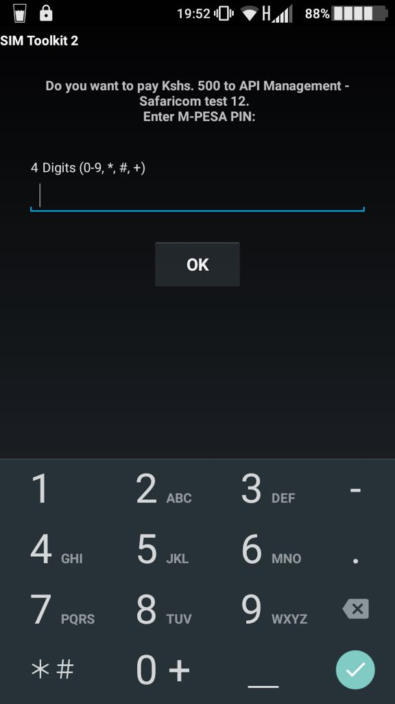

# MpesaStk
Lipa na M-Pesa Online Payment API is used to initiate a M-Pesa transaction on behalf of a customer using STK Push. This is the same technique mySafaricom App uses whenever the app is used to make payments.

## Installation

Add this line to your application's Gemfile:

```ruby
gem 'mpesa_stk'
```

And then execute:

    $ bundle or $ bundle install

Or install it yourself as:

    $ gem install mpesa_stk

## Version
 Mpesa_stk is currently at `1.0.0 version`

## Usage

one needs to setup there environment variables, checkout `.sample.env`
```
base_url="https://sandbox.safaricom.co.ke"
token_generator_url="/oauth/v1/generate?grant_type=client_credentials"
process_request_url="/mpesa/stkpush/v1/processrequest"

key=""
secret=""
business_short_code=""
business_passkey="
callback_url="
```
this can be found in [Test Credentials](https://developer.safaricom.co.ke/test_credentials)
* `key` and `secret` of your application key.
* `business_short_code`  and `business_pass_key` from safaricom.
* `callback_url` the url of your application.


### Implementation

This now becomes the easy part. After all the pieces above have been set all you need to do is:
open your console and add.
```
require 'mpesa_stk'
```

```
MpesaStk::PushPayment.call("500", "<YOUR PHONE NUMBER: 254711222333>")
```

### Output
This is the expected output
 


## Development

After checking out the repo, run `bin/setup` to install dependencies. Then, run `rake test` to run the tests. You can also run `bin/console` for an interactive prompt that will allow you to experiment.

To install this gem onto your local machine, run `bundle exec rake install`. To release a new version, update the version number in `version.rb`, and then run `bundle exec rake release`, which will create a git tag for the version, push git commits and tags, and push the `.gem` file to [rubygems.org](https://rubygems.org).

## Contributing

Bug reports and pull requests are welcome on GitHub at https://github.com/mboya/mpesa_stk.

To Contribute to this gem,
* Comment on the issue you would like to work on solving.
* Mark the issue as in progress by adding an `in-progress` label.
* Fork the project to your github repository (This project only accepts PRs from forks)
* Submit the PR after the implementation all unfinished PRs for an issue should have a WIP indicated beside it
* Every PR should have a link to the issue being solved
* Checkout this [github best practices](https://github.com/skyscreamer/yoga/wiki/GitHub-Best-Practices) for more info.

## License

The gem is available as open source under the terms of the [MIT License](https://opensource.org/licenses/MIT).

## Code of Conduct

Everyone interacting in the MpesaStk project’s codebases, issue trackers, chat rooms and mailing lists is expected to follow the [code of conduct](https://github.com/mboya/mpesa_stk/blob/master/CODE_OF_CONDUCT.md).
